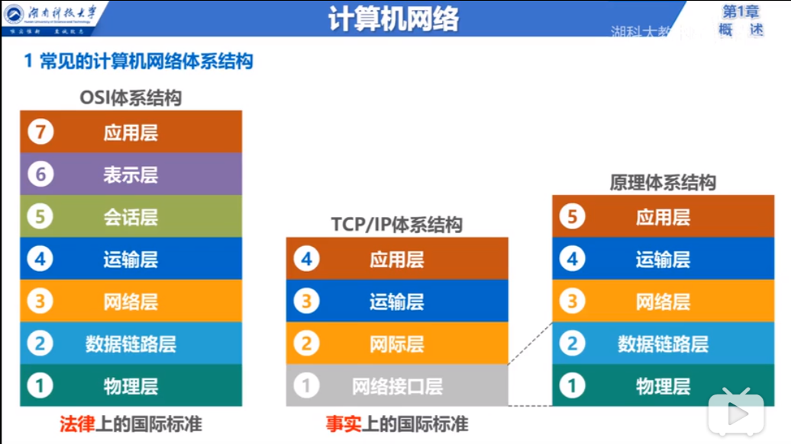
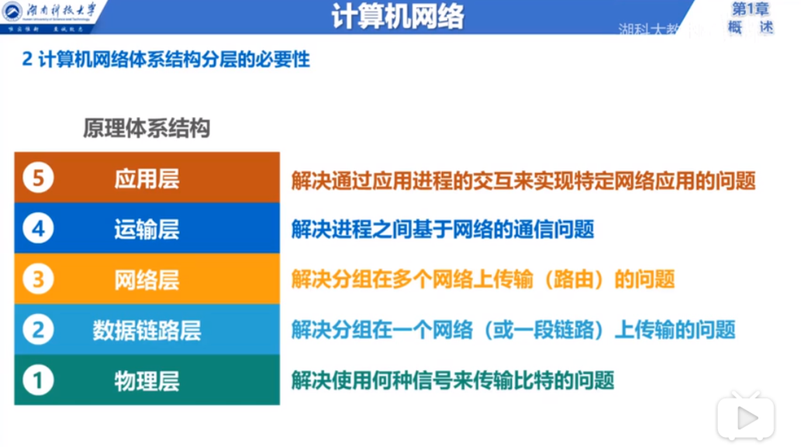

# 计算机网络

1. [网络分层](#网络分层)
2. [物理层](#物理层)
3. [数据链路层](#数据链路层)
4. [网络层](#网络层)
5. [传输层](#传输层)
6. [应用层](#应用层)

## 网络分层

- TCP/IP体系结构（4层，事实标准）
  1. 物理链路层
  2. 网络层
  3. 传输层
  4. 应用层
  
- OSI体系结构（7层，法律标准）
  1. 物理层
  2. 数据链路层
  3. 网络层
  4. 传输层
  5. 会话层
  6. 表示层
  7. 应用层
  
- 原理体系结构（5层，便于学习）
  1. 物理层
  2. 数据链路层
  3. 网络层
  4. 传输层
  5. 应用层

  

## 物理层

### 比特信号传输

解决使用何种信号来传输比特的问题：

1. 传输媒体（介质， 如双绞线）
2. 物理接口（如网卡接口）
3. 信号表示（比特0和1的方波）

## [数据链路层](./n01link/README.md)

### 分组在一个网络上传输

解决分组在一个网络（或一段链路）上传输的问题：

1. 标识网络中主机（MAC地址）
2. 从比特流信号中分离出地址和数据（协议）
3. 协调主机争用总线（协议）

## [网络层](./n02ip/README.md)

### 分组在多个网络上传输

解决分组在多个网络上传输（路由）的问题：

1. 标识网络以及网络主机（IP地址）
2. 路由器转发分组，路由选择

### 协议

1. IP
2. ICMP

## 传输层

### 进程间基于网络的通信

解决进程间基于网络的通信问题：

1. 应用进程间基于网络通信
2. 处理传输错误

### 协议

1. TCP
2. UDP

## 应用层

### 实现特定的网络应用

解决通过应用进程的交互来实现特定网络应用的问题：

1. 应用进程间的交互来完成特定的网络应用

### 协议

1. HTTP
2. HTTPS
3. FTP
4. BGP
5. SMTP
6. DNS
7. RTP
8. TFTP
9. SNMP
10. DHCP

