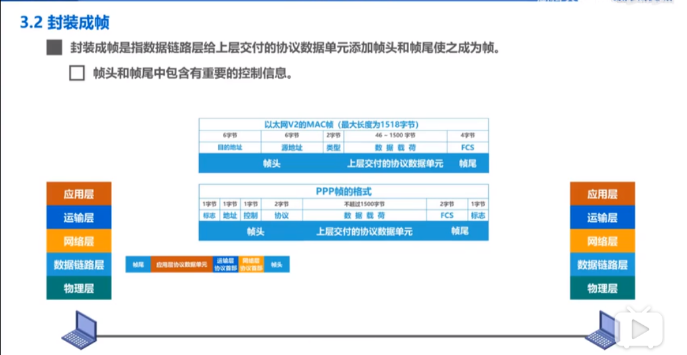
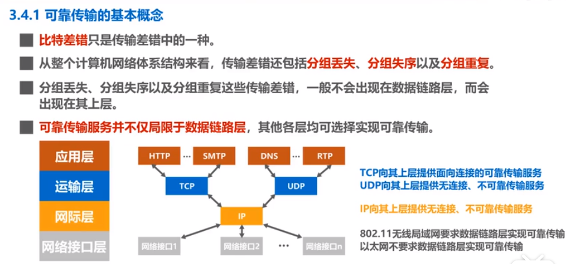
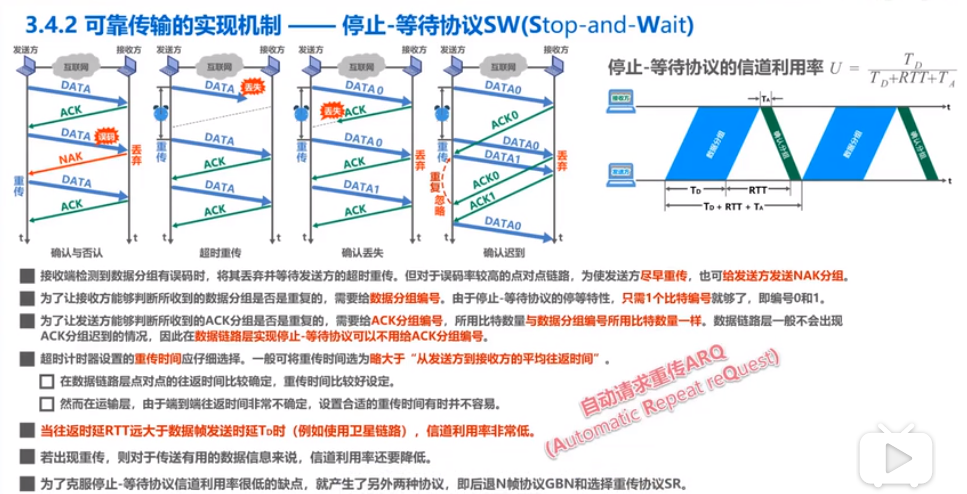
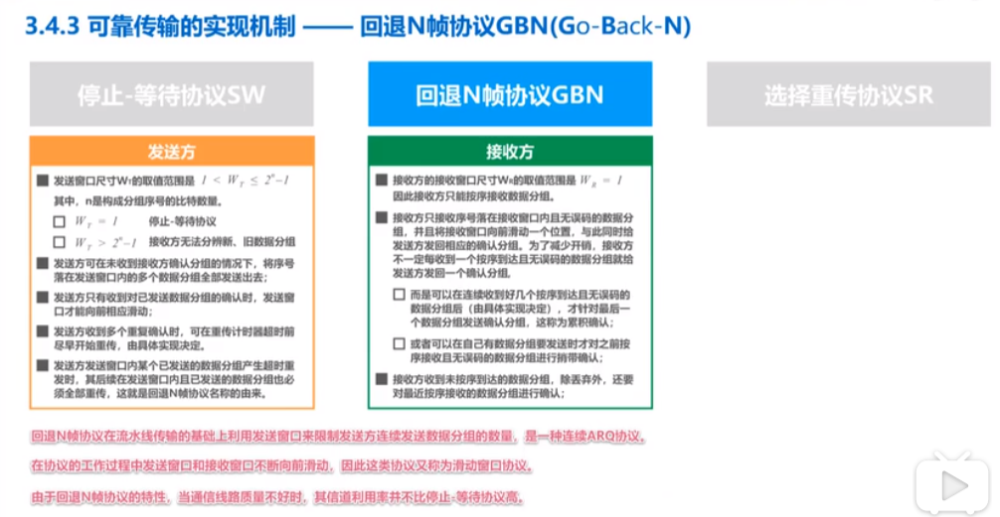

# 数据链路层

三个重要问题：

1. [封装成帧](#封装成帧)
2. [差错检测](#差错检测)
3. [可靠传输](#可靠传输)
   - [上层的服务类型](#上层的服务类型)
   - [基本概念](#基本概念)
   - [实现机制](#实现机制)

### 封装成帧

- 封装成帧：数据链路层将上层交付的协议数据单元添加帧头回退帧尾，使之成为帧
  - 帧头和帧尾中包含有重要的控制信息
  - 帧头和帧尾的作用之一就是帧定界
- 透明传输：数据链路层对上层交付的传输数据没有任何限制，就好像数据链路层不存在一样
  - 面向字节的物理链路层使用字节填充的方法实现透明传输
  - 面向比特的物理链路层使用比特填充的方法实现透明传输

### 差错检测	

- 奇偶校验：在待发送的数据后面添加1位奇偶校验码，使整个数据中“1”的个数为奇数或偶数。但不靠谱
- 循环冗余校验CRC（Cyclic Redundancy Check）：实际使用
  - 收发双方约定好一个生成多项式G(x)
  - 发送方基于待发送数据和生成多项式计算出差错检测码（冗余码），将其添加后数据尾部一起传输
  - 接收方通过生成多项式来计算收到的数据是否产生了误码

### 可靠传输

#### 上层的服务类型

- 不可靠传输服务：仅仅丢弃有误码的帧，其他什么也不做
- 可靠传输服务：想办法实现发送端发送什么，接收端就收到什么

#### 基本概念

- 比特差错（数据链路层）
- 整个计算机网络体系结构看，传输差错还有分组丢失，分组失序，分组重复
- 分组丢失，分组失序，分组重复，一般不出现在数据链路层，而会出现在其上层
- 可靠传输服务并不仅仅局限于数据链路层，其他各层均可选择实现可靠传输

#### 实现机制

1. 停止-等待协议SW

2. 回退N帧协议GBN

   在流水线传输的基础上，利用发送窗口来限制发送方可连续发送数据分组的个数；

   

3. 选择重传协议SR	