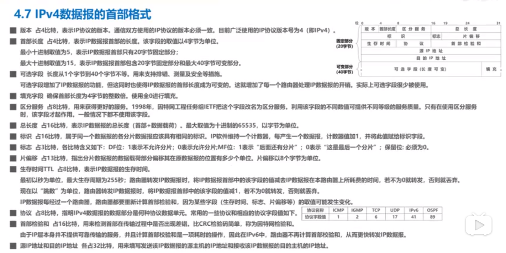

# 网络层（IP层）

## 目录

1. [网络层概述](#网络层概述)
2. [网络层提供的两种服务](#网络层提供的两种服务)
3. [IPV4数据报首部格式](#IPV4数据报首部格式)
4. [网际控制报文协议ICMP](#网际控制报文协议ICMP)

### 网络层概述

- 网络层的主要任务：实现网络互联，进而实现数据包在各网络之间的传输
- 实现网络层的任务，需要解决以下主要问题：
  - 网络层向传输层提供怎样的服务（可靠传输，还是不可靠传输）
  - 网络层寻址问题
  - 路由选择问题

### 网络层提供的两种服务

1. 面向连接的虚电路服务

2. 无连接的数据报服务

### IPV4数据报首部格式

### 网际控制报文协议ICMP

- 目的：更有效的转发IP数据报和提高交付成功的机会
- 主机或路由器使用ICMP来发送差错报告报文和询问报文
- ICMP报文被封装在IP数据报中发送
- ICMP应用：ping、traceroute