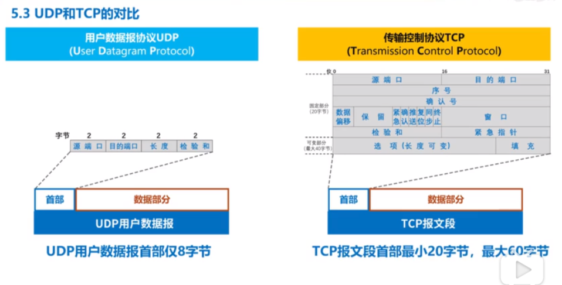
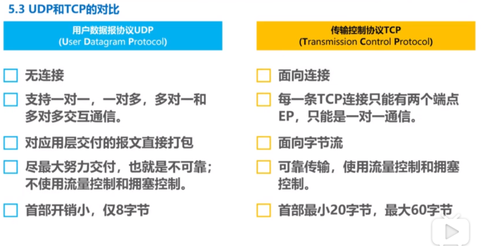

# 传输层（端到端）

## 目录

1. [概述](#概述)
2. [网络层提供的两种服务](#网络层提供的两种服务)
3. [IPV4数据报首部格式](#IPV4数据报首部格式)
4. [网际控制报文协议ICMP](#网际控制报文协议ICMP)

### 概述

- 主要任务：为运行在不同主机上的应用进程提供直接的通信服务（逻辑通信服务）
- 实现网络层的任务，需要解决以下主要问题：
  - 网络层向传输层提供怎样的服务（可靠传输，还是不可靠传输）
  - 网络层寻址问题
  - 路由选择问题

### UDP和TCP的对比
UDP和TCP首部格式

详细比较：

