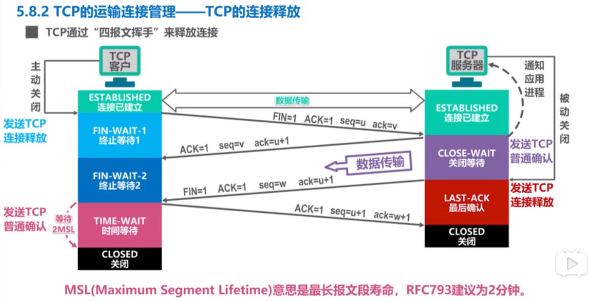

# 传输层（端到端）

## 目录

1. [概述](#概述)
2. [UDP和TCP的对比](#UDP和TCP的对比)
3. [流量控制](#流量控制)
4. [拥塞控制](#拥塞控制)
5. [可靠传输的实现](#可靠传输的实现)
6. [连接建立](#连接建立)
7. [连接释放](#连接释放)
8. [TCP的head](#TCP的head)

### 概述

- 主要任务：为运行在不同主机上的应用进程提供直接的通信服务（逻辑通信服务）
- 实现网络层的任务，需要解决以下主要问题：
  - 网络层向传输层提供怎样的服务（可靠传输，还是不可靠传输）
  - 网络层寻址问题
  - 路由选择问题

### UDP和TCP的对比
UDP和TCP首部格式

详细比较：

### 流量控制

1. 一般来说，我们总希望数据传输快一些
   - 但发送方把数据发送得过快，接收方就可能来不及接受，这就造成数据丢失
2. 流量控制：**让发送方的发送速率不要太快，要让接收方来得及接收**
3. 利用**滑动窗口**机制，可很方便的在TCP连接上实现对发送方的流量控制
   - TCP接收方利用自己的接收窗口大小，来限制发送方发送窗口的大小
   - TCP发送方收到接收方的零窗口通知后，启动 **持续计时器**。持续计时器超时后，向接收方发送零窗口探测报文

### 拥塞控制

拥塞：在某段时间，若对网络中的某一资源的需求，超过了该资源所能提供的，网络性能就会变坏

### 可靠传输的实现

基于字节流的滑动窗口来实现

### 连接建立

### 连接释放

### TCP的head

